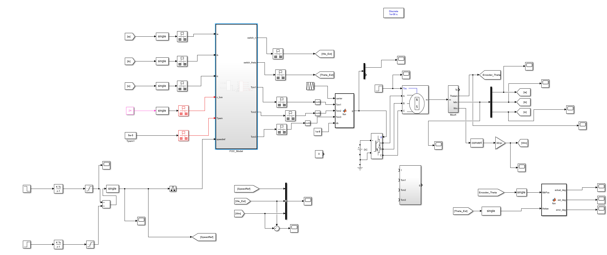
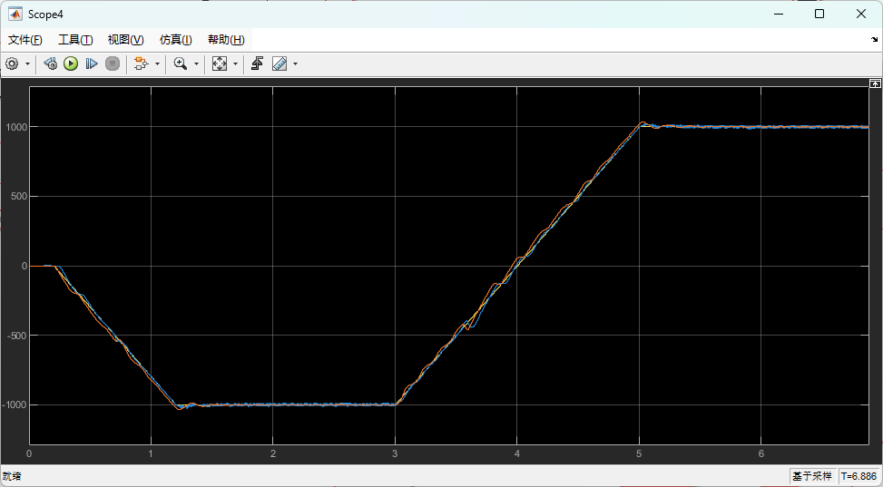
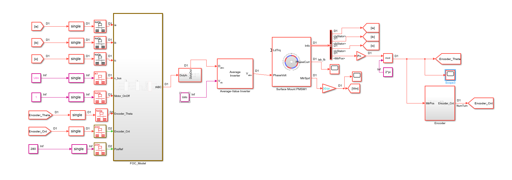
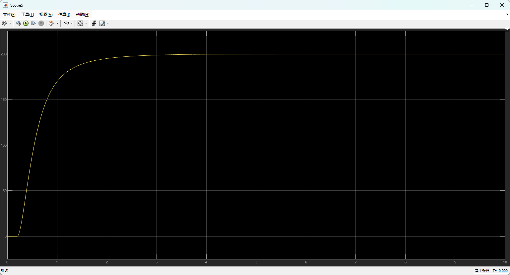
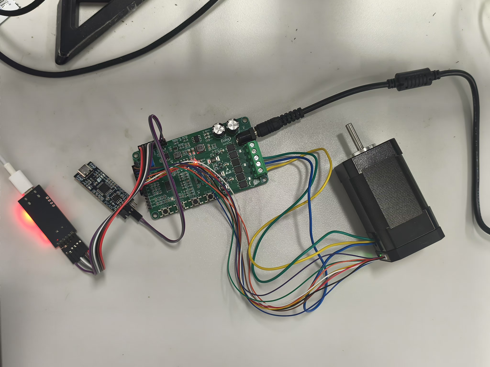

# PMSM 电机控制

这里记录了两个基于 STM32G431CBU6 的 PMSM 控制项目：无位置传感器转速控制和编码器位置闭环控制。仓库中保留了 Simulink 模型、STM32 工程以及调试时使用的 VOFA+ 配置。

## HFI / SMO-PLL 无感控制

对应目录：[`HFI_SMOPLL`](HFI_SMOPLL)

低速段采用高频注入估算转子位置，中高速段使用滑模观测器与锁相环估算转速和角度。工程中包含算法模型、STM32 代码和速度跟踪结果。

### 仿真模型



### 转速跟踪



## 有感位置闭环控制

对应目录：[`PosLoop`](PosLoop)

采用编码器获取转子位置，在电流环和速度环的基础上加入位置环，实现位置指令跟踪。

### 仿真模型



### 位置响应

下图为 200° 位置指令的仿真结果，黄色曲线为位置反馈，蓝色曲线为目标位置。



### 实物平台



## 目录

```text
PMSM/
├─ HFI_SMOPLL/
│  ├─ HFI_AVi.sldd
│  ├─ HFI_UB_counter_latch.slx
│  ├─ STM32G4_FOC_Speedloop_SMO/
│  └─ VOFA GUI/
├─ PosLoop/
│  ├─ posloop.sldd
│  ├─ posloop.slx
│  ├─ STM32G4_FOC_Posloop/
│  └─ VOFA GUI/
└─ docs/images/
```

## 开发环境

- MATLAB / Simulink R2021b
- STM32CubeMX
- Keil MDK-ARM
- VOFA+

